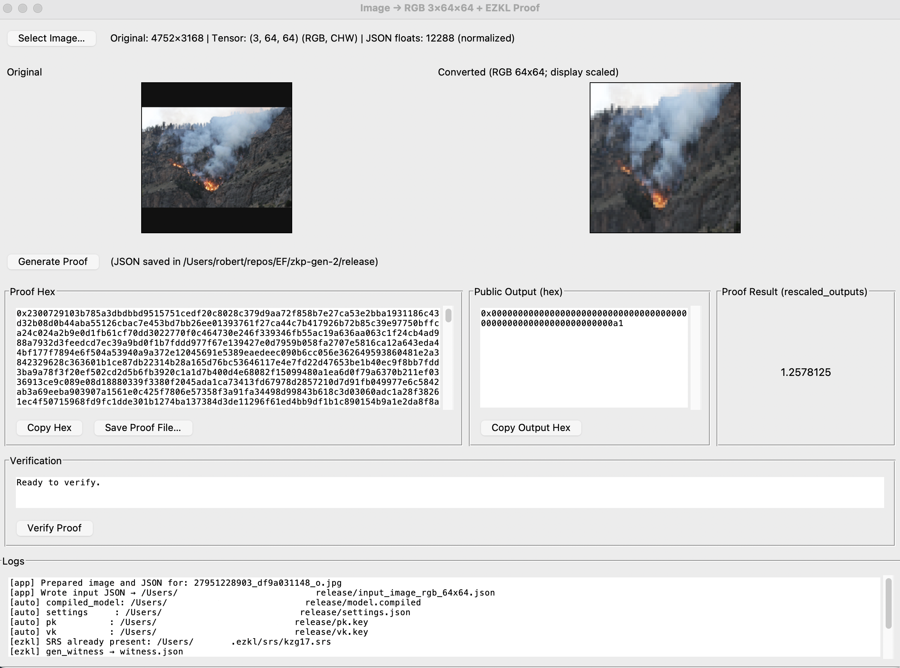

# Proof Generating App - Social Activation



This app allows you to generate Zero-Knowledge proofs using the EZKL library easily and outputs the required information to verify the proof on-chain.

## Setup, Build and/or Run

The simplest way to just run the app is download the latest release, unzip the file and run `ZKPGeneratorApp`.

Otherwise you can [build the app and run](#build-into-app) or [run from scratch](#build-and-run-from-source).

#### Build into app

Recommend (tested with) python version 3.10.18

1. Setup python venv and install requirements
```bash
python -m venv venv
source venv/bin/activate
pip install -r requirements.txt
```

2. Build with pyinstaller
```bash
pyinstaller --onefile --windowed \
    --name "ZKPGeneratorApp" \
    --add-data "network.onnx:." \
    app.py
```

3. Create release app
```bash
mkdir release
cp dist/ZKPGeneratorApp release/.
cp network.onnx release/.
touch release/README.txt
touch release/LICENSE
```

4. Get correct ezkl version for OS.
```bash 
# MacOS
curl --output release/ezkl.tar.gz -L https://github.com/zkonduit/ezkl/releases/download/v22.2.1/build-artifacts.ezkl-macos-aarch64.tar.gz
tar -xvzf release/ezkl.tar.gz -C ./release
rm  ./release/ezkl.tar.gz

# Windows
curl --output release/ezkl.tar.gz -L https://github.com/zkonduit/ezkl/releases/download/v22.2.1/build-artifacts.ezkl-windows-msvc.tar.gz
tar -xvzf release/ezkl.tar.gz -C ./release
rm  ./release/ezkl.tar.gz

# Linux
curl --output release/ezkl.tar.gz -L https://github.com/zkonduit/ezkl/releases/download/v22.2.1/build-artifacts.ezkl-linux-gnu.tar.gz
tar -xvzf release/ezkl.tar.gz -C ./release
rm  ./release/ezkl.tar.gz
```

5. Rename release file, zip and release
```bash
zip -r ZKPGeneratorApp_macOS_v0.zip ZKPGeneratorApp_macOS_v0
```

#### Build and run from source

Recommend (tested with) python version 3.10.18

If you do not want to run setup manually, you can just skip to step 8 and the app should setup itself.

1. Install ezkl
```bash
curl https://raw.githubusercontent.com/zkonduit/ezkl/main/install_ezkl_cli.sh | bash
```

2. Setup python venv and install requirements
```bash
python -m venv venv
source venv/bin/activate
pip install -r requirements.txt
```

3. Generate settings file
```bash
ezkl gen-settings
```

4. Setup settings file. More information for this can be found in [extra info](/etc/EXTRA_README.md)

5. Get srs file
```bash
ezkl get-srs
```

6. Drop network.onnx into the file. Preparation of this model can be found in [extra info](/etc/EXTRA_README.md). An example version is given.

7. Compile ezkl circuit and setup prover
```bash
ezkl circuit
ezkl setup
```

8. Run app
```
python app.py
```

9. Extra execution steps 
```bash
ezkl verify --proof-path proofs/proof.json
ezkl create-evm-verifier
```


